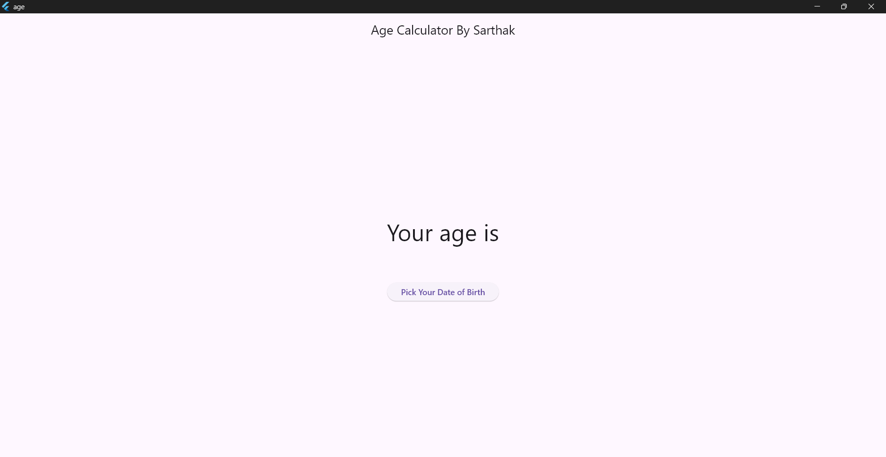
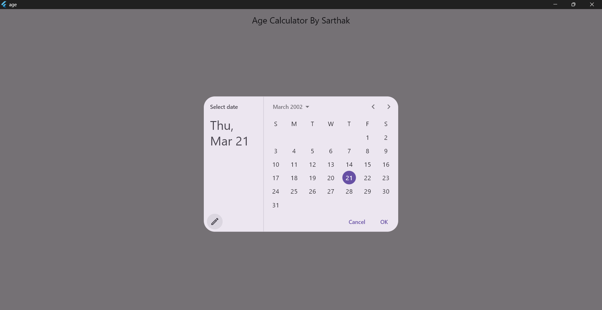
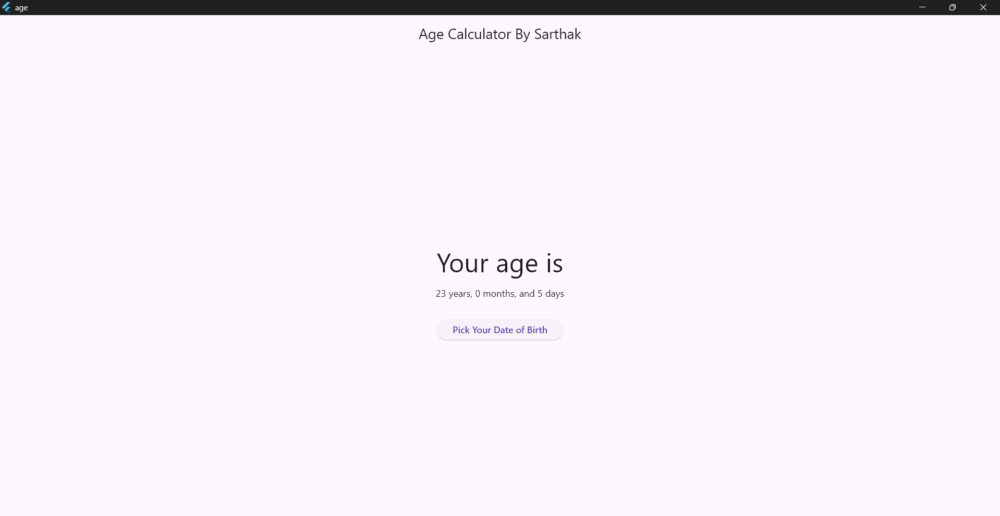

# 📅 **Age Calculator - Flutter App**  

### 🔥 **Project Overview**  
A simple and efficient **Age Calculator** built using **Flutter** that accurately calculates a user's age based on their birthdate selection.  

## 🚀 **Key Features**  

✅ **Objective:** Allows users to pick their birthdate and calculates their exact age.  
✅ **Functionality:** Provides the precise age in **years, months, and days**.  
✅ **Technology Used:** Developed using **Flutter** and **Dart** with a smooth and intuitive UI.  
✅ **Accuracy:** Considers leap years and varying month lengths for precise calculations.  
✅ **Use Case:** A quick and reliable tool for users to determine their exact age.  

## 📌 **How It Works**  
1️⃣ **User selects their birthdate** from a date picker.  
2️⃣ **App processes the input** and calculates the exact age.  
3️⃣ **Displays the result** in years, months, and days format.  

## 📸 **App Screenshots**  

### 📱 Home Screen  
  

### 📅 Date Picker  
  

### 🎯 Age Calculation Result  
  

